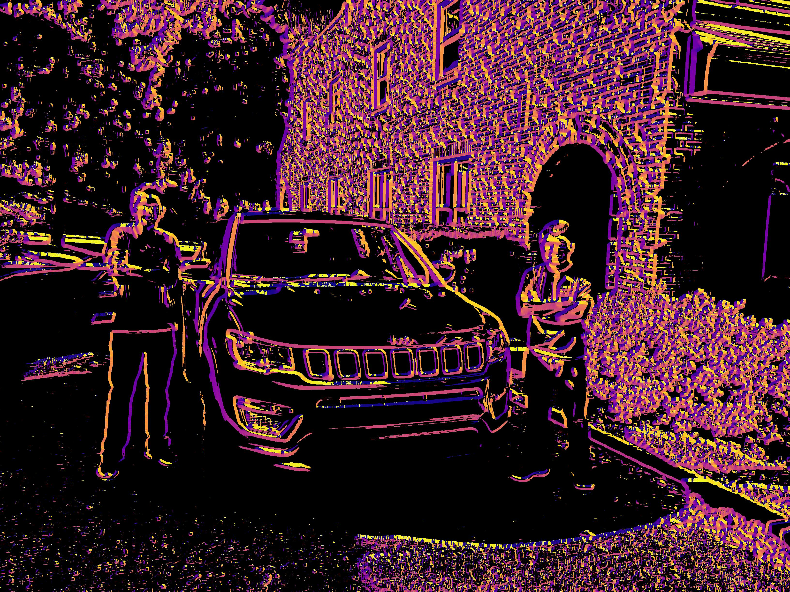
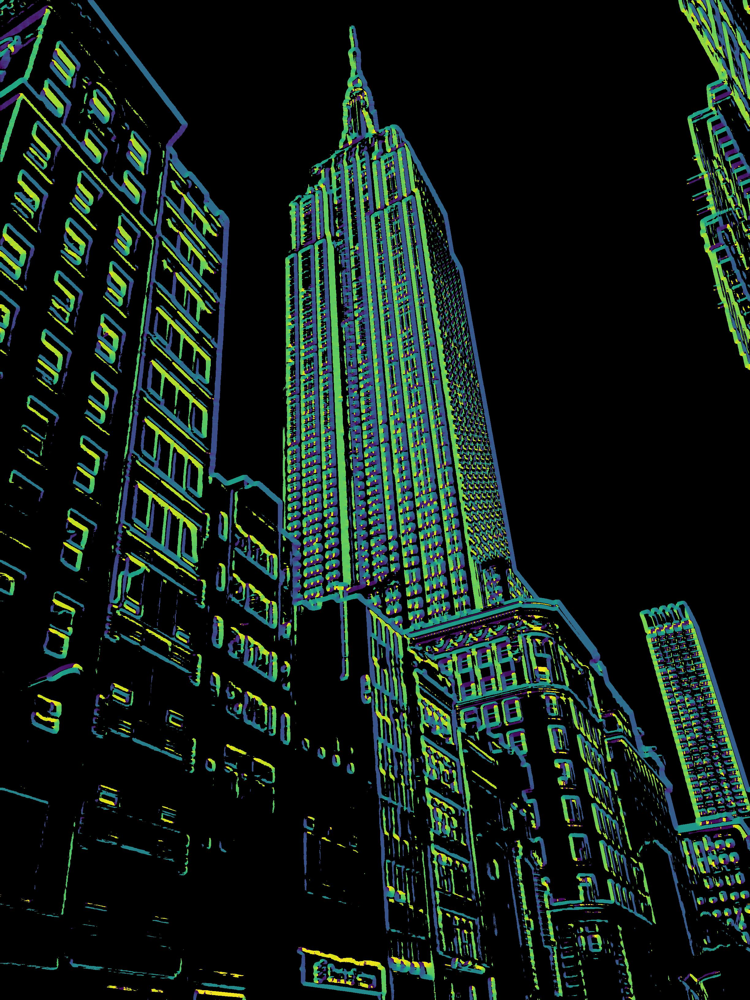

# edge-colorizer

Edge Colorizer is a program that detects edges in an image and colors them in a deliberate and coherent manner. It uses an image processing pipeline that consists of a series of convolutions and other matrix operations to blur an image, detect edges, and color the edges pixel-by-pixel. The final result is an image that resembles a skeleton of the original image, colored with bright, neon colors and contrasted against a black background.

Results:

